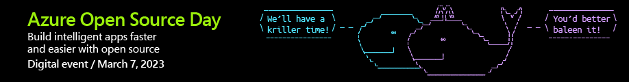

Learn how to build intelligent, scalable apps faster — and with more flexibility — at Azure Open Source Day, a free digital event on March 7, 2023. Join this free digital event to see the latest open-source technology in action—while connecting with the community of industry leaders, innovators, and open-source enthusiasts. If you can't make the show on the day you can view the [content on-demand at any time](https://info.microsoft.com/ww-landing-azure-open-source-day.html
).

# Azure Open Source Day 2023 - Australia  and New Zealand

We are also celebrating Azure Open Source Day 2023 across Australia and New Zealand. Check out our activities below!

## Cloud Skills Challenge

Compete in our Open Source and Serverless Cloud Skills Challenge for the chance to win swag and prizes! The Challenge will be running from 10 March until 7 April and you will be able to pre-register to compete from 1 March. 

Link coming soon!

## Celebrate with your local community!

A range of local user groups will be helping us to celebrate Azure Open Source Day 2023. You can connect with these groups to learn more:

- Details
- to
- be
- confirmed.
